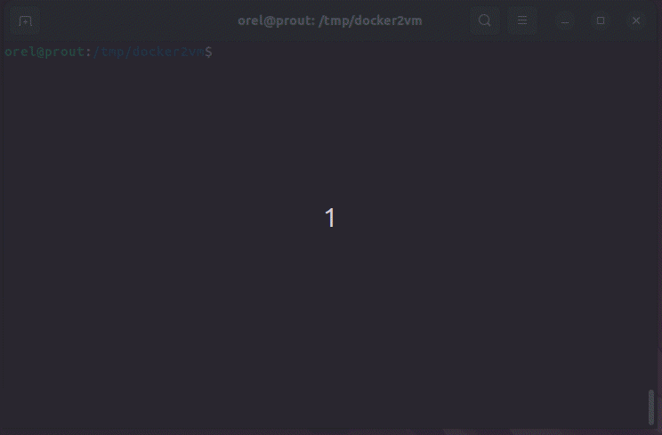

# Make a VM Image from a Docker Image

We propose here a small script to convert a docker image into a VM image (qemu),
based on [libguestfs](https://libguestfs.org) tools for simplicity. This work is
inspired by [iximiuz's
blog](https://iximiuz.com/en/posts/from-docker-container-to-bootable-linux-disk-image/),
also available on [GitHub](https://github.com/iximiuz/docker-to-linux).

## Usage

Given a docker container `<docker>`, our script `./docker2vm.sh` makes an output
VM image `<vm.img>` (in raw format), that runs on `qemu-system-x86_64`. This
script requires *root* privilege.

```
Usage: ./docker2vm.sh <docker> <vm.img>
```
## Requirements for Host

First, you need to install **Docker** and **Qemu**. Then, you need to fulfill
these additional requirements for *libguestfs* or *extlinux*.

```bash
$ sudo apt install qemu-system-x86 qemu-utils
$ sudo apt install guestfs-tools extlinux
```

## Requirements for Guest

You need to install in your docker container both a Linux kernel (`/vmlinuz` and
`/initrd` files) and *systemd* (`/sbin/init`). Update your *Dockerfile* with this command:

```Dockerfile
RUN apt install -yq linux-image-amd64 systemd-sysv
```

While this step is not useful for the container itself, it will be useful to
make a bootable VM image.

Besides, we provide a simple bootloader configuration for `extlinux`, that is
described in in [syslinux.cfg](syslinux.cfg). Here, we append the kernel option
`console=ttyS0` to enforce the system boot in text-mode.

## Demo

Lets's consider a basic [Dockerfile](Dockerfile.demo) based on a Linux *Debian
11*.

```bash
# build docker
$ docker build -f Dockerfile.demo -t tmp/demo .
# make vm image
$ sudo ./docker2vm.sh tmp/demo demo.img
# change image owner
$ sudo chown $USER:$USER demo.img
# remove docker image (if needed)
$ docker image rm --force tmp/demo
# test vm with Qemu
$ qemu-system-x86_64 -enable-kvm -m 1G -hda demo.img -nographic
```



Finally, you can convert this raw image in another format for Qemu (qcow2) or
VirtualBox (vdi).

```bash
# convert in qcow2 format for Qemu
$ qemu-img convert -c demo.img -O qcow2 demo.qcow2
# convert in vdi format for VirtualBox
$ VBoxManage convertfromraw --format vdi demo.img demo.vdi
```

---
<aurelien.esnard@u-bordeaux.fr>
